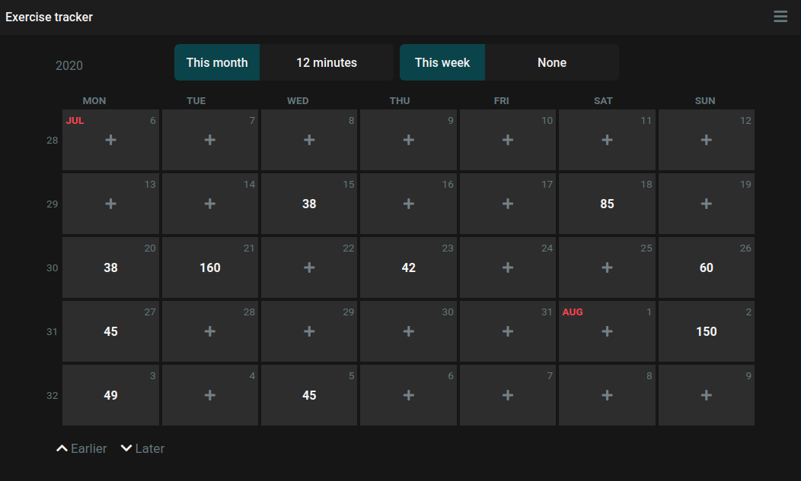

# TODO

redirect in frontend when route doesn't exist

# Exercise tracker




# copy table from one db to another

```
pg_dump -d \<connection-string\> -a -t \<table-name\> | psql -Atx \<connection-string\>
```

## run in dev
start services
```
docker-compose up
```
start the server in REPL
```
lein repl
```
start the frontend's REPL
```
lein figwheel
```

## Development mode

Run migrations
```
lein migratus
```


To start the Figwheel compiler, navigate to the project folder and run the following command in the terminal:

```
lein figwheel
```

Figwheel will automatically push cljs changes to the browser. The server will be available at [http://localhost:3449](http://localhost:3449) once Figwheel starts up. 

Figwheel also starts `nREPL` using the value of the `:nrepl-port` in the `:figwheel`
config found in `project.clj`. By default the port is set to `7002`.

The figwheel server can have unexpected behaviors in some situations such as when using
websockets. In this case it's recommended to run a standalone instance of a web server as follows:

```
lein do clean, run
```

The application will now be available at [http://localhost:3000](http://localhost:3000).


### Optional development tools

Start the browser REPL:

```
$ lein repl
```
The Jetty server can be started by running:

```clojure
(start-server)
```
and stopped by running:
```clojure
(stop-server)
```


## Building for release

```
lein do clean, uberjar
```

## Deploying to Heroku

Make sure you have [Git](http://git-scm.com/downloads) and [Heroku toolbelt](https://toolbelt.heroku.com/) installed, then simply follow the steps below.

Optionally, test that your application runs locally with foreman by running.

```
foreman start
```

Now, you can initialize your git repo and commit your application.

```
git init
git add .
git commit -m "init"
```
create your app on Heroku

```
heroku create
```

optionally, create a database for the application

```
heroku addons:add heroku-postgresql
```

The connection settings can be found at your [Heroku dashboard](https://dashboard.heroku.com/apps/) under the add-ons for the app.

deploy the application

```
git push heroku master
```

Your application should now be deployed to Heroku!
For further instructions see the [official documentation](https://devcenter.heroku.com/articles/clojure).
